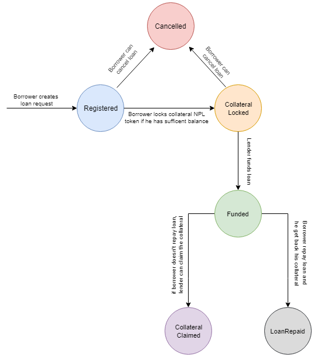

# NepLend Smart Contract

* Neplend Contract can be defined as autonomous and decentralized platform which is used for loan agreement between parties. 

* Neplend is developed to solve the problem which is decrease in credit investment.Thus, it can build healty relationship between parties.

* NLP token is used for _colleteral_ in the loan agreement. Borrower gives it to platform as a _colleteral_, if borrower does not pay back this loan within specified time, token will be given to lender automatically.


## Terms
* **Borrower**: Specifes borrower person. She creates loan request.

* **Lender**: Specifes lender person. She can funds a loan request.

* **loanId**: Id of a loan which is created by borrower.

* **borrowedAsset**: The type of asset which is demanded by borrower. (smart contract only supports neo)

* **borrowedAmount**: Amount of borrowing.

* **collateralAmount**: Amount of NPL tokens which will be pledged as _collateral_ by the borrower. (This amount is locked by the smart contract, after the loan has been funded) 

* **premiumAmount**: The amount will be paid in addition to the _borrowedAmount_.

* **daysToLend**: Specified time period for the repayment of loan.

## Scenario Steps
1. Borrower creates loan request. Borrower must specify loanId, borrowedloanId, borrowedAsset, borrow amount, premium amount, collateral amount and daysToLend parameters.

2. If the borrower has sufficient NPL tokens for that request, her NPL tokens will be pledges as _colleteral_.

3. The loan is funded by the lender.  After the fund transaction completed, the loan request can not be canceled by the borrower. The collateral tokens remain in the locked status until borrower repays the loan. 

4. There are 2 different situations for this step:

- If the borrower repays the loan, the NPL tokens which has been pledged as collateral will return to the borrower’s account.

- If the borrower can not repay the loan within specified time period, the NPL tokens which has been pledged as collateral will go to the lender's account.



*Status Diagram of the Loan Request in Smart Contract*
## How to Invoke Smart Contract Step by Step
__I made a simple script to explain invoking step by step.__

*Usage Video*
[https://www.youtube.com/watch?v=1bB2wiDYALQ](https://www.youtube.com/watch?v=1bB2wiDYALQ)

Firstly, you should make sure that there are two accounts for borrower and lender. Both of them should have sufficient neo and gas assets. We will invoke smart contract with a _nodejs application_ which uses `neon-js` library.

To start invoking, go into nodejs application folder (`neplend-node`) and install dependencies.
```
$ cd neplend-node
$ npm install
```
Before the following steps, you should change the **wif** keys of _account1(borrower)_ and _account2(lender)._


### Step-1) Minting NPL Tokens (by borrower)
Borrower account should mint NPL tokens for creating loan request. Borrower execute invocationTX with attached neo for minting NPL tokens.

**InvocationParameters**
```
operation="mintTokens"

args=[]
```


*Mints 400 NPL Tokens*

### Step-2) Creating Loan Request (by borrower)
It creates new loan request.

**Invoke Parameters**
```
operation="createLoanRequest"

args=[loadIdHexStr, reverseHexOfBorrowerScriptHash, reverseHexBorrowAssetId, amountBorrowed, amountCollateral, amountPremium, daysToLendUnixTime]
```


The calling upper function creates a new loan request with the following properties.
```
BorrowedAsset: Neo
Borrow amount: 6
Collateral NPL Token Amount: 220 NPL
Premium: 1 Neo,
DaysToLend: Specifies time period for the repayment of loan with Unix time format. 86400 seconds equals 1 day. 

Note: 
- After completion of invocation, take note of the loanId. It can be found in terminal output.
- collateralAmount parameter MUST HAVE zeros in its decimals. For instance, if you want to use 220 NPL as collateral, you should set parameter value to 22000000000. (8 decimals)
```

### Step-3) Lock Collateral for Loan (by borrower)
The borrower's tokens should be pledges as _colleteral_.

**Invoke Parameters**
```
operation="lockCollateralForLoan"
args=[loanIdHexStr, reverseHexOfBorrowerScriptHash]
```


### Step-4)  Fund Loan (by lender)
Loan can be funded by the lender. A sufficient amount of assets must be sent within a single transaction.

**Invoke Parameters**
```
operation="fundLoan"
args=[loanIdHexStr, reverseHexOfLenderScriptHash]
```


### Step-5.1) Repay Loan (by borrower)
If the borrower wants to repay loan, she must invoke the following invocationTx. Borrower must send required amount (borrowed+premium) asset to the lender.
For repaying the loan, borrower must send to required amount within single transaction.

**Invoke Parameters**
```
operation="repayLoan"
args=[loanIdHexStr, reverseHexOfBorrowerScriptHash]
```


*account1(borrower), account2(lender)*

### Step-5.2) Put in a Claim for Collateral (by lender)
If the borrower can not repay the loan in the specified time period, the lender put in a claim for collaterals and take them to her account.

**Invoke Parameters**
```
operation="claimCollateral"
args=[loanIdHexStr, reverseHexOfLenderScriptHash]
```

## Other Functions
* ### Cancel Loan

**Invoke Parameters**
```
operation="cancelLoan"
args=[loanIdHexStr, reverseHexOfBorrowerScriptHash]
```

* ### balanceOf
Gets balance of account


* ### printLoanStatus
Prints loan status


**Outputs**
```
Registered:20, CollateralLocked:21, Funded:22, Cancelled:23, CollateralClaimed:24, LoanRepaid:25
```

## License
The MIT License (MIT)

Copyright (c) 2018 Oguzhan ERGIN

Permission is hereby granted, free of charge, to any person obtaining a copy of this software and associated documentation files (the "Software"), to deal in the Software without restriction, including without limitation the rights to use, copy, modify, merge, publish, distribute, sublicense, and/or sell copies of the Software, and to permit persons to whom the Software is furnished to do so, subject to the following conditions:

The above copyright notice and this permission notice shall be included in all copies or substantial portions of the Software.

THE SOFTWARE IS PROVIDED "AS IS", WITHOUT WARRANTY OF ANY KIND, EXPRESS OR IMPLIED, INCLUDING BUT NOT LIMITED TO THE WARRANTIES OF MERCHANTABILITY, FITNESS FOR A PARTICULAR PURPOSE AND NONINFRINGEMENT. IN NO EVENT SHALL THE AUTHORS OR COPYRIGHT HOLDERS BE LIABLE FOR ANY CLAIM, DAMAGES OR OTHER LIABILITY, WHETHER IN AN ACTION OF CONTRACT, TORT OR OTHERWISE, ARISING FROM, OUT OF OR IN CONNECTION WITH THE SOFTWARE OR THE USE OR OTHER DEALINGS IN THE SOFTWARE.